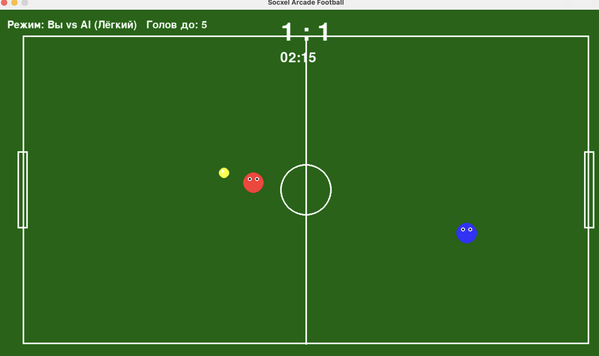

# Socxel: Аркадный футбол

Динамичная футбольная аркада с управлением в одно касание

## Скриншот игры



## Режимы игры
- **1 vs 1** – два игрока на одной клавиатуре
- **1 vs AI** – против компьютера (лёгкий, средний, сложный)

## Управление
- Левый игрок / человек: **W A S D**
- Правый игрок (режим 1v1): **стрелки**
- **R** – сбросить мяч в центр
- **M** – вернуться в главное меню
- **ESC** – выход

## Правила
- Матч до **5 голов** или **3 минут**
- Побеждает тот, у кого больше голов

## Технологии
- Python 3
- Pygame

## Видео
[Скачать видео (нажми для загрузки)](https://rutube.ru/video/private/609c0e4bfc979b71b26367d4984c6c54/?p=zgHL9ACdTAowce-hodbDbQ)

## Запуск
```bash
pip install pygame
python fb3.py


